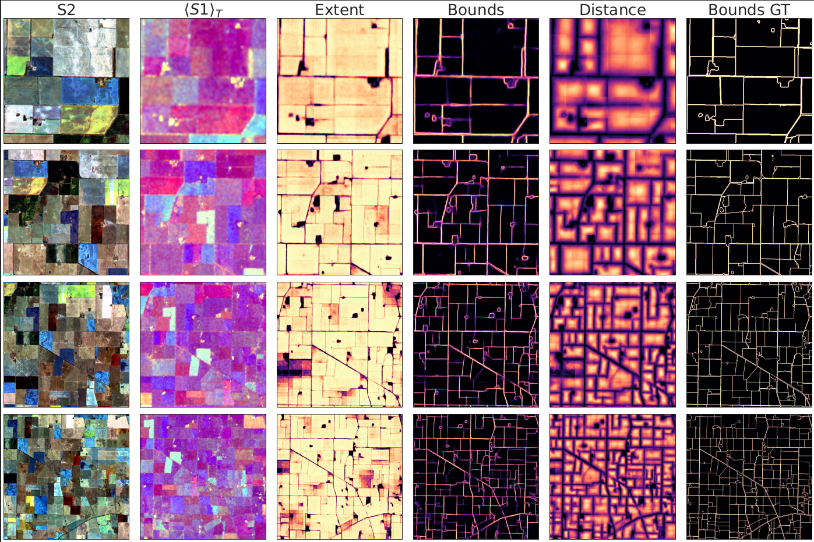

# Tackling fluffy clouds: field boundaries detection using time series of S2 and/or S1 imagery
Official repository for our manuscript [Tackling fluffy clouds: field boundaries detection using time series of S2 and/or S1 imagery.](https://arxiv.org/abs/2409.13568). 

# Model Brief: 3D Vision Transformer for Field Boundary Delineation

This repository hosts the implementation of a 3D Vision Transformer designed for efficient field boundary delineation using time series satellite imagery. The model leverages spatio-temporal correlations to improve accuracy and robustness, particularly in challenging conditions such as partial cloud cover.

## Key Features:
- **3D Vision Transformer Architecture**: Adapted for handling time series data, the model processes either Sentinel-2 (S2) optical imagery or Sentinel-1 (S1) SAR data, or a combination of both, through a memory-efficient attention mechanism.
- **Handling Cloud Contamination**: The model is capable of extracting field boundaries even from cloud-contaminated imagery by leveraging S2 time series. For dense cloud coverage, the model effectively switches to S1 data, which is unaffected by clouds.
- **Dual Implementation**: The repository provides two models: 
  - **PTAViT3D**: Processes either S2 or S1 time series independently.
  - **PTAViT3D-CA**: A cross-attention model designed for fusing S2 and S1 time series data.
- **High-Resolution Predictions**: When trained on S1 inputs, the model achieves spatial resolution comparable to S2 (10m), offering precise boundary delineation.
- **Extensive Coverage**: Demonstrated on the large-scale agricultural area in Australia, showcasing the model's scalability and efficiency.

## Results:
### Example  of inference using time series of S2 imagery.
<div align="center">
         
</div>
<div align="center">

</div>

### Example of inference using time series of S1 imagery.        
<div align="center">

</div>


## Software envinment    
Container ready for use can be found on      
+ NVIDIA: docker pull fdiakogiannis/trchprosthesis_requirements:24.07-py3


## Model forward 
We provide demo notebooks that show how the models, PTAViT3D and PTAViT3D-CA can be used (demo forward). Please see the [ssg2](https://github.com/feevos/ssg2) repository for further details on RocksDB dataset creation and additional information. We recommend using the dataset [ai4boundaries](https://github.com/waldnerf/ai4boundaries/tree/main) for your experiments, that provides time series of Sentinel2 images and corresponding ground truth labels.  **Update**: added demo training notebook for the PTAViT3D model too.


## A song too?   
In the era of AI, we decided to make a song for our paper using suno. You can listen to it [here](https://suno.com/song/3ff72217-2a85-4af2-87d5-9f5b50c9c68c).

## Lyrics
**Verse 1**
Fluffy clouds up in the sky  
Drawing maps from way up high  
Boundaries in the field we find  
With time and space we're intertwined  

**Verse 2**
Satellite's eye sees far and wide  
SAR and S2A both provide  
Imagery that guides our way  
To detect the lines we survey  

**Chorus**
Oh fluffy clouds they show the route  
Through fields where patterns sprout  
With every image scanned and seen  
We paint the picture on the screen  

**Verse 3**
In the fields the borders blur  
Technology makes them clearer  
In the waves and colors found  
We trace the lines upon the ground  

**Verse 4**
From the skies we gather clues  
Through the earth's ever-changing hues  
Data streams like melodies  
Unlock the secrets of the trees  

**Bridge**
Oh the future's looking bright  
With every satellite in flight  
Mapping out the earth below  
In fields of green and golden glow  


# License
CSIRO MIT/BSD LICENSE

As a condition of this licence, you agree that where you make any adaptations, modifications, further developments, or additional features available to CSIRO or the public in connection with your access to the Software, you do so on the terms of the BSD 3-Clause Licence template, a copy available at: http://opensource.org/licenses/BSD-3-Clause.

**If you find this repository helpful please star it as this helps us continue our work. Thank you.**

# CITATION     
```
@misc{diakogiannis2024tacklingfluffycloudsfield,
      title={Tackling fluffy clouds: field boundaries detection using time series of S2 and/or S1 imagery}, 
      author={Foivos I. Diakogiannis and Zheng-Shu Zhou and Jeff Wang and Gonzalo Mata and Dave Henry and Roger Lawes and Amy Parker and Peter Caccetta and Rodrigo Ibata and Ondrej Hlinka and Jonathan Richetti and Kathryn Batchelor and Chris Herrmann and Andrew Toovey and John Taylor},
      year={2024},
      eprint={2409.13568},
      archivePrefix={arXiv},
      primaryClass={cs.CV},
      url={https://arxiv.org/abs/2409.13568}, 
}     
```
